# Hi, I'm Shivansh 👋

<picture>
  <source media="(prefers-color-scheme: dark)" srcset="./dark(1).svg">
  
</picture>

  <b>CSE Undergraduate · DSA Learner  · Web Development Explorer</b>

  💻 C++ / DSA &nbsp;·&nbsp; ⚛️ React &nbsp;·&nbsp; ⚡ AWS Lambda &nbsp;·&nbsp; ⚙️ Node.js &nbsp;·&nbsp; ☁️ Cloud Computing &nbsp;·&nbsp; 🏗️ System Design

I’m currently strengthening my programming foundations through **DSA, web development projects, cloud technologies, and hands-on hackathons**.

My current engineering interests sit at the intersection of **AI/LLMs, C++, cloud computing, scalable systems, full-stack development, backend architecture, and developer automation.**.

---
